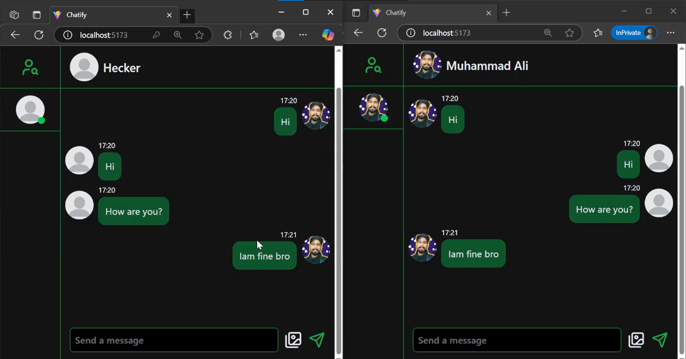

# 🗨️ Mern Chatting Website

It is a real-time chat website where two users can chat with each other, send images, and can also update their profile image. The platform requires users to sign up, then log in to start chatting. This application is built using the **MERN Stack** and features real-time functionality with **Socket.IO**.

## 🚀 Features

- 💬 **Real-time Chat**: Users can chat with each other in real-time.
- 🖼️ **Image Sharing**: Send and receive images during chats.
- 🖼️ **Profile Picture Update**: Users can update their profile images.
- 📝 **Sign Up / Log In**: Users must sign up and log in to use the website.
- 🔒 **Secure**: User authentication security using **JWT** and password hashing with **bcrypt.js**.

## 💻 Tech Stack

- **Frontend**:  
  - React 19 ⚛️  
  - **MERN Stack** (MongoDB, Express, React, Node.js)
  - **Tailwind CSS** for styling 🎨
  - **Lucide React** for icons 🔲
  - **Axios** for making API requests 📡
  - **React HotToast** for toast notifications 🥂
  - **Zustand** for state management 🧠

- **Backend**:  
  - **Node.js** with **Express.js** 🌐
  - **Socket.IO** for real-time functionality (instant chat) 🔌
  - **JWT (JSON Web Token)** for user authentication 🔑
  - **bcrypt.js** for password hashing 🔐
  - **Mongoose** for MongoDB management 🗃️
  - **Cloudinary** for image storage ☁️